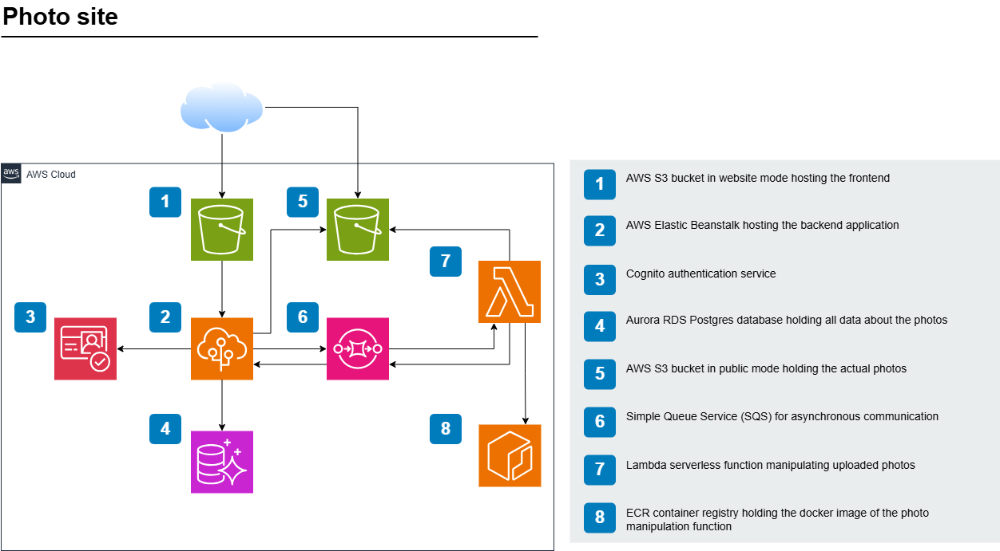
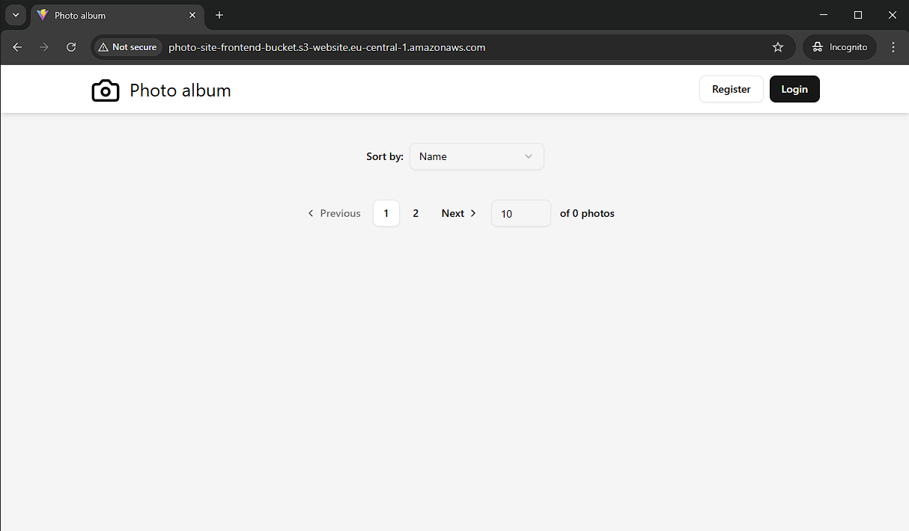
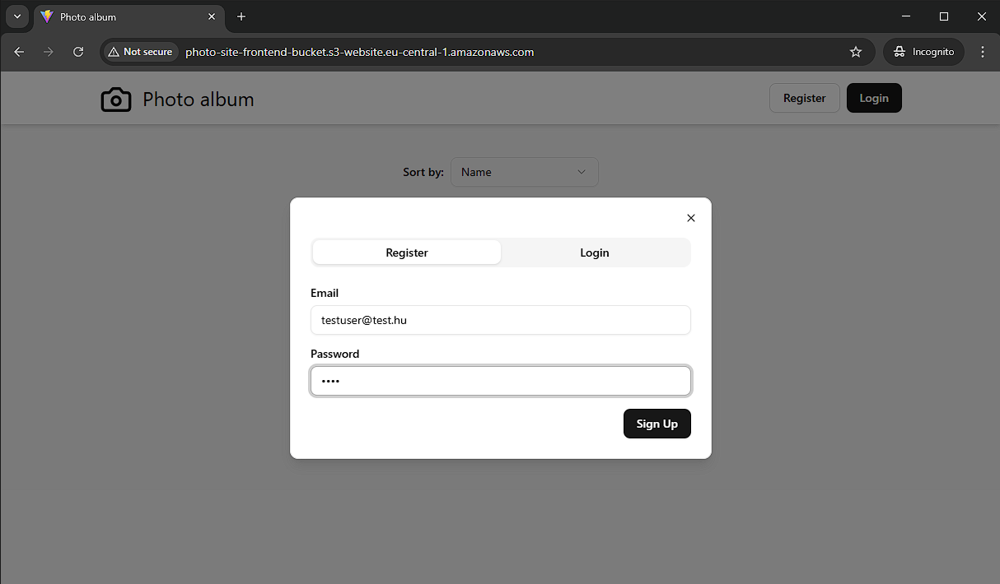
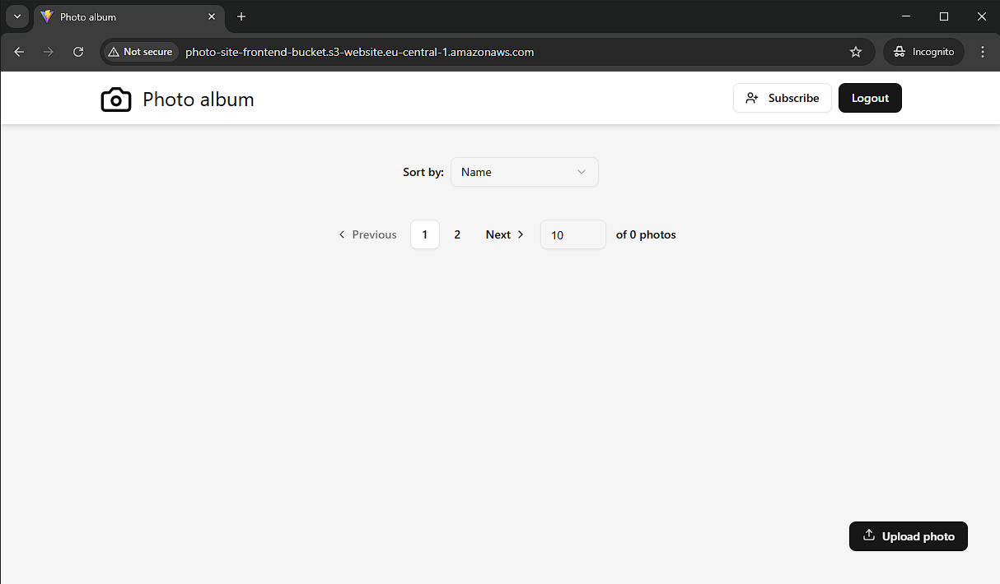
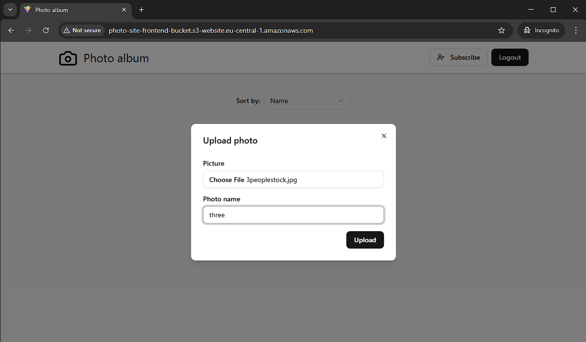
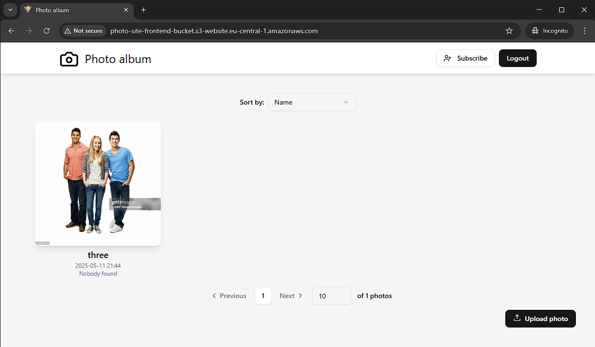
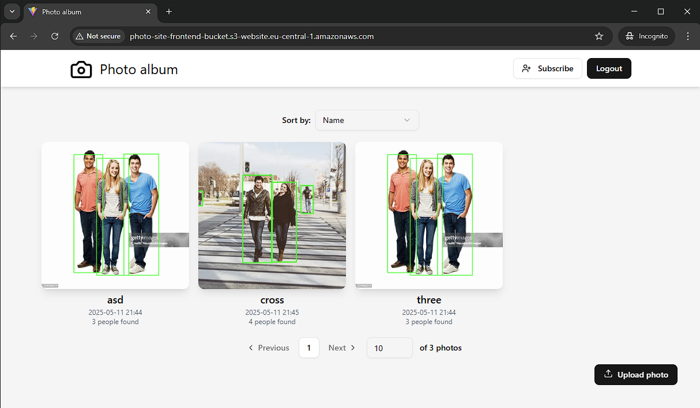
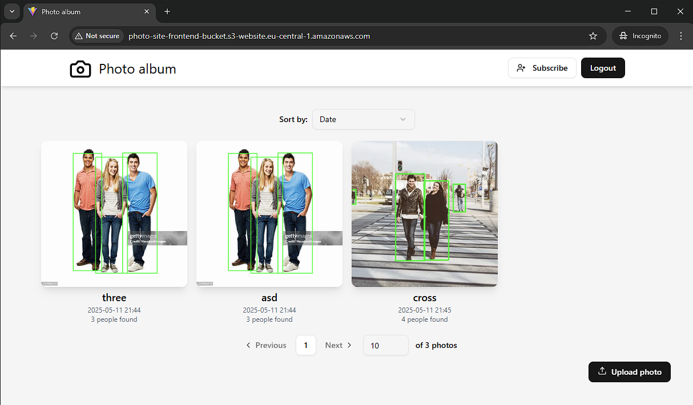
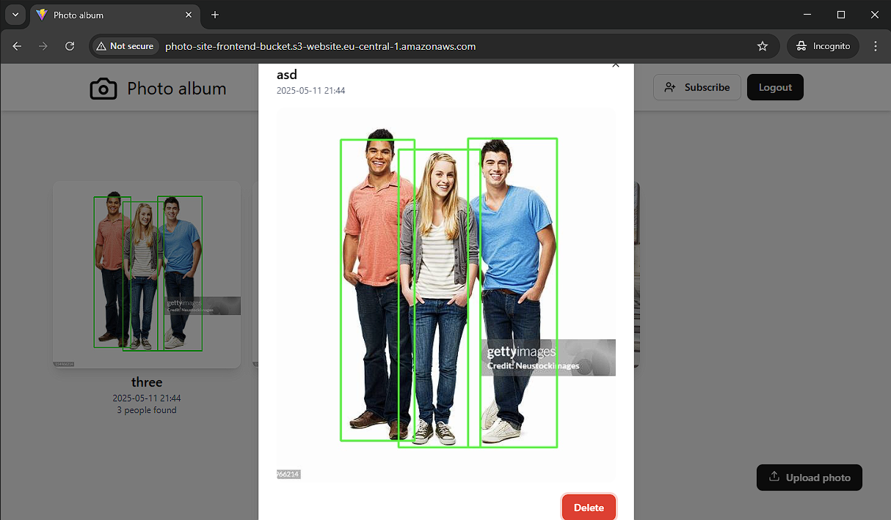
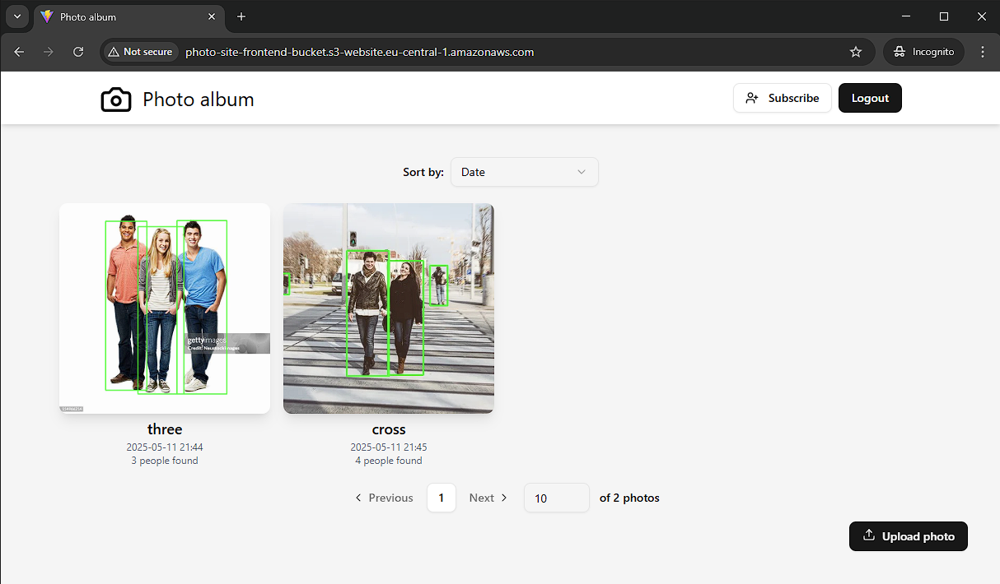

# Photo site
[Link to the application](http://photo-site-frontend-bucket.s3-website.eu-central-1.amazonaws.com)

## Architecture

### Frontend Website
The frontend application was built using React and Vite. A major advantage of this setup is that Vite can compile a static website from the React application. The resulting product is hosted using S3's static website hosting, which is extremely cost-effective—practically free. For example, 1 GB of used storage costs only a few cents per month, while a simple website only takes a few kilobytes.

### Backend Server
The backend for the photo application was implemented in Kotlin using the Spring Boot framework. AWS Elastic Beanstalk, a PaaS solution, was used to host it. This means we only needed to develop and upload the code; the platform handles everything else. This significantly reduced the development time required to get the first version of the web app running, as we didn't have to deal with infrastructure, networking, DNS configuration, or maintenance.

### Cognito Authentication Server
AWS Cognito is a serverless authentication solution. Compared to self-hosted alternatives like Keycloak on a dedicated VM or container, it offered many advantages during development. First, it saved time by eliminating the need for installation and maintenance. It's also cost-effective, being completely free for up to 10,000 users. Since it supports most standards, implementing JWT-based authentication in my application required only a few dozen lines of code.

### RDS Postgres on Aurora
I needed a relational database for data persistence. For an app of this size, the database type isn't critical; we chose Postgres based on personal preference. With low load, cost impact is minimal, but serverless clearly had the advantage. Newer versions of Aurora support auto-scaling based on demand, even down to zero, which helped reduce costs.

### Photo Storage
Just like the frontend, images were stored in AWS S3. Beyond the near-free cost of storage, it's easy to enable public access to stored objects. This allowed me to display images on the website without any additional processing.

### Asynchronous Messaging with SQS
To take advantage of serverless simplicity and cost-efficiency for a small project, we used AWS's native Simple Queue Service (SQS) for asynchronous communication. When a user uploads an image, it becomes immediately available in the app without waiting for processing. A message queue handles this by triggering downstream processing, which later replaces the image.

### Image Processing
The processing task involves detecting people in the images. A pre-trained model detects people, counts them, draws bounding boxes, and overwrites the original file in S3 with the results. This use case fits well with a FaaS model. we implemented the solution using an AWS Lambda function, which only runs when triggered. The trigger is the arrival of a message in the queue, making the process fully asynchronous.

### ECR Image Repository
The model used for people detection has dependencies not available in standard AWS Lambda environments. The simplest solution was to package the function as a Docker image. Since AWS Lambda integrates best with other AWS-native services, we uploaded the Docker image to the AWS Elastic Container Registry (ECR).

## CI/CD
The above described architecture is deployed on-demand with the help of Terraform, an IaC tool. Deployment is automatically triggered and run by Github actions. This combination easily allows rapid destruction of the environment, saving costs when not needed.

## User workflow

### Site after a fresh install

### Signing up

### Site after logging in

### Uploading an image

### Site after upload

### Site after multiple uploads and detection run

### Sorting by upload date

### Selecting a picture

### Deleting a picture

